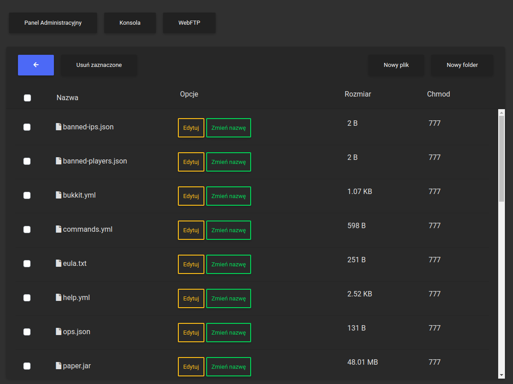
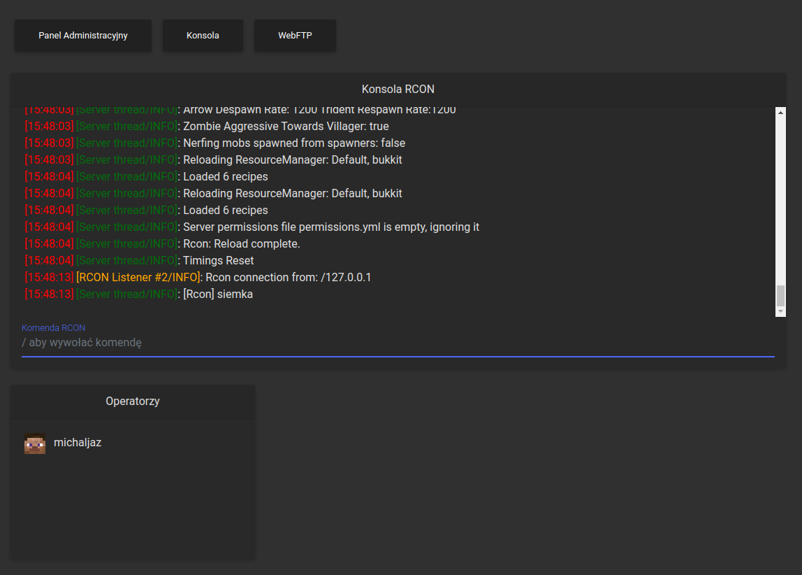
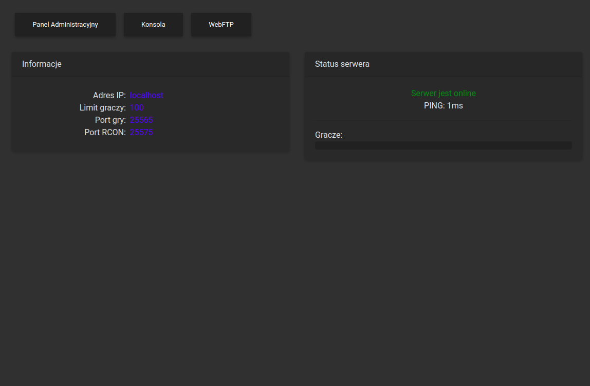

# mcpanel
Prosty panel zarządzania serwerem minecraftowym.<br>


<h3>Instalacja:</h3>

```bash
git clone https://github.com/michaljaz/mcpanel
cd mcpanel

#instalacja bibliotek
npm install

#Uruchamianie serwera
npm start
```

> **Ważne:** Przy uruchamianiu potrzebna jest najnowsza wersja node.js i npm.<br>
>  Przed uruchomieniem serwera zapoznaj się z plikiem config.json</u>.<br>
>  Ważne jest to aby ścieżka do twojego servera kończyła się na <b>'/'</b> (np.: '/home/user/Desktop/server<b>/</b>')</u>.<br>

<h3>Plik konfiguracyjny(config.json):</h3>

```php
{
	"server":{
		"host":"localhost",
		"port":25565,
		"path":"/ścieżka/do/plików/twojego/serwera/"
	},
	"panel":{
		"login":"admin",
		"password":"password",
		"port":8080
	}
}
```

     <br><br>

     <br><br>

     <br><br>
